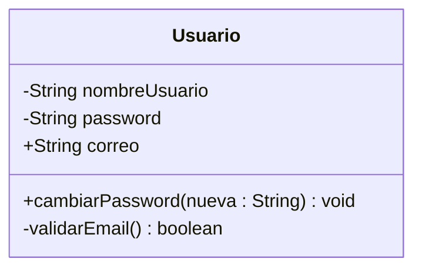
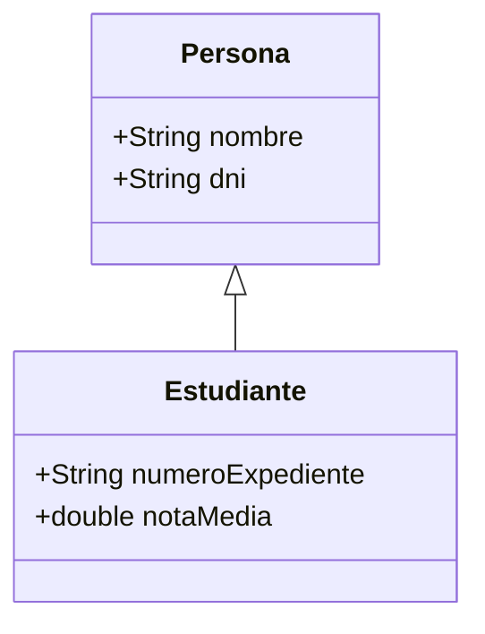
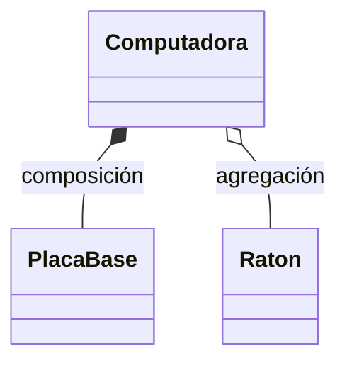
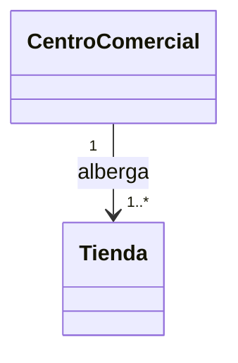
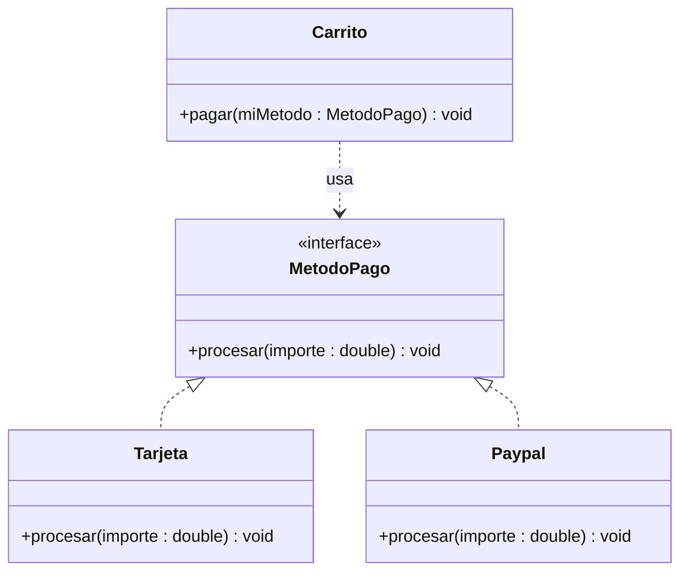

# 6.2.Bateria-de-ejercicios

EJERCICIO 1 

```mermaid
classDiagram
    class Usuario {
        -String nombreUsuario
        -String password
        +String correo
        +cambiarPassword(nueva : String) void
        -validarEmail() boolean
    }
```
EJERCICIO 2

```mermaid
classDiagram
    class Persona {
        +String nombre
        +String dni
    }

    class Estudiante {
        +String numeroExpediente
        +double notaMedia
    }

    Persona <|-- Estudiante
```
EJERCICIO 3

``` mermaid
classDiagram
    class Computadora {
    }

    class PlacaBase {
    }

    class Raton {
    }

    Computadora *-- PlacaBase : composición
    Computadora o-- Raton : agregación
```
EJERCICIO 4

``` mermaid
classDiagram
    class CentroComercial {
    }

    class Tienda {
    }

    CentroComercial "1" --> "1..*" Tienda : alberga
```

EJERCICIO 5

```mermaid
classDiagram
    class MetodoPago {
        <<interface>>
        +procesar(importe : double) void
    }

    class Tarjeta {
        +procesar(importe : double) void
    }

    class Paypal {
        +procesar(importe : double) void
    }

    class Carrito {
        +pagar(miMetodo : MetodoPago) void
    }

    MetodoPago <|.. Tarjeta
    MetodoPago <|.. Paypal
    Carrito ..> MetodoPago : usa

```

