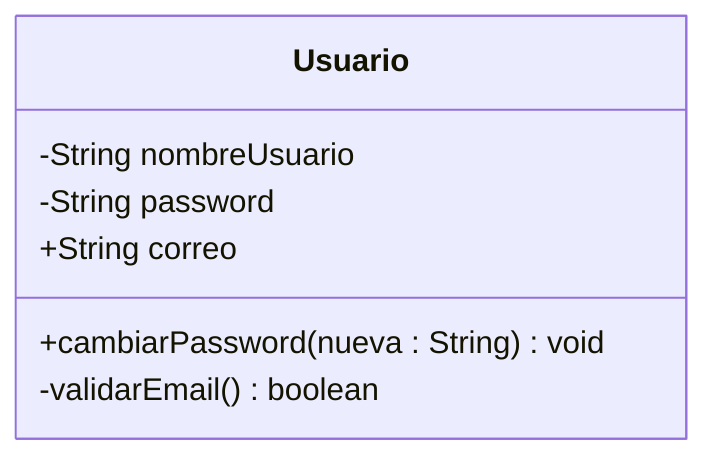
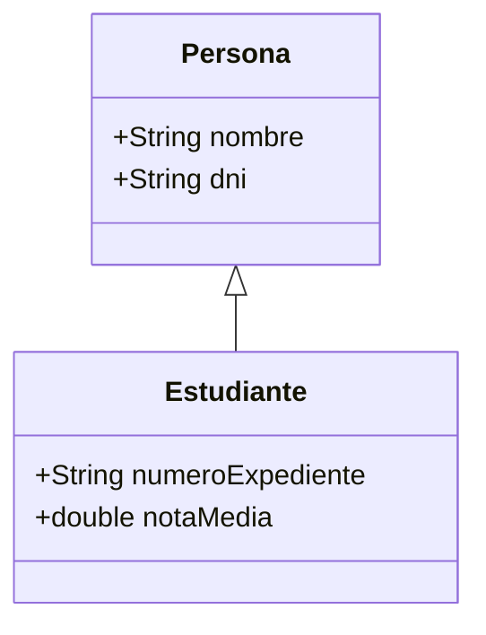

# 6.2.Bateria-de-ejercicios

EJERCICIO 1 

```mermaid
classDiagram
    class Usuario {
        -String nombreUsuario
        -String password
        +String correo
        +cambiarPassword(nueva : String) void
        -validarEmail() boolean
    }
```

```mermaid
classDiagram
    class Persona {
        +String nombre
        +String dni
    }

    class Estudiante {
        +String numeroExpediente
        +double notaMedia
    }

    Persona <|-- Estudiante
```
